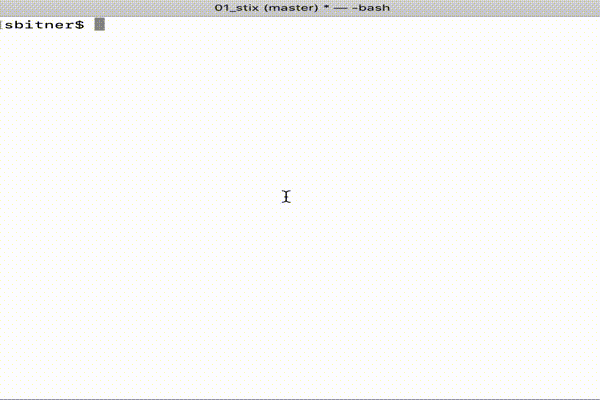

# Project 1 - Stix

## Project Outcomes - Develop a Java program that:
* Creates a user designed class.
* Uses proper design techniques.
* Reads input from the keyboard using a Scanner Object and its methods.
* Uses selection (if and if else) statements.
* Uses iteration (while, do while or for) statements.
* Uses String comparison methods.
* Follows standard acceptable programming practices.
* Handles invalid input ranges and types.

## Prep Readings:
Zybooks chapter 1 - 6
### Background Information:
Stix is a simplified version of an ancient game.
1. It is played by two players.
1. A number of sticks (like matches) are placed on a table.
1. The first player takes 1, 2, or 3 sticks away, provided that there are still that many on the table.
1. Then the second player takes 1, 2 or 3 sticks away (if possible), and so on.
1. Whoever takes the last stick, loses.

## Project Requirements:
1. The programs asks for:
	1. The initial number or Stix (between 5 and 30).
	1. Whether or not the computer (program) goes first.
1. The program alternates turns between the computer and the player until the number of Stix drops to 0.
1. Depending on who took the last stick, it declares the winner.
1. Input Validation - The program must be stable under illegal inputs.
	1. For numeric data, non-numeric input must be rejected and ranges must be indicated in the prompt and checked.

## Sample run

_**Computer goes first and wins**_
```
How many Stix should be used? [5 - 30]: 12
Computer goes first? [y/n]: y
Stix on the table: ||||||||||||
Computer takes 3
Stix on the table: |||||||||
How many stix to take? [1 - 3]: 3
Stix on the table: ||||||
Computer takes 1
Stix on the table: |||||
How many stix to take? [1 - 3]: 2
Stix on the table: |||
Computer takes 2
Stix on the table: |
How many stix to take? [1 - 1]: -1
Input must be between 1 and 1
How many stix to take? [1 - 1]: 0
Input must be between 1 and 1
How many stix to take? [1 - 1]: nooooo!
Value must be an integer
How many stix to take? [1 - 1]: 1

Computer wins!!!
```



## Programming Strategy
There's not a lot of things the program can do about the human player's choices while they're legal.
But the number of Stix the program removes is an interesting problem.
1. The computer must pick 1, 2, or 3, but cannot pick more Stix than there are remaining.
1. Most situations, however, have a choice that will result in a victory for the computer.
	1. The player (user or program) cannot force a win from every number of Stix.
	1. When no optimal move exists, the computer must pick _something_.
